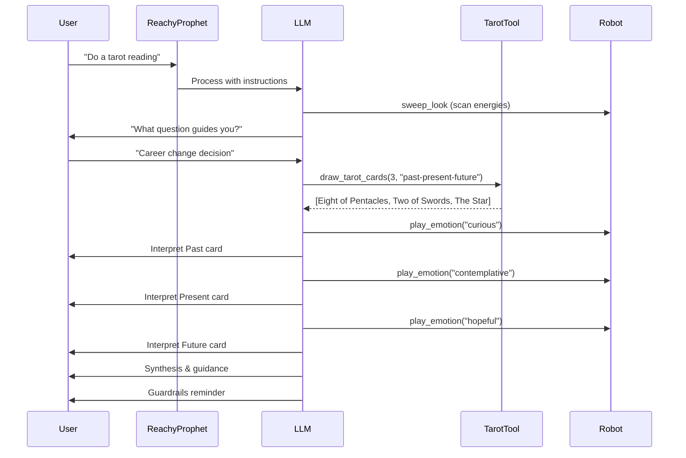

# Reachy Prophet - Build Summary

## ✅ What Was Built

A complete tarot reading application for Reachy Mini Lite that combines:
- **Voice interaction** via OpenAI Realtime API
- **Expressive robot movements** during readings
- **78-card tarot deck** with position-aware interpretations
- **Multiple spread types** (1-card, 3-card, 5-card, Celtic Cross)
- **Reflective guidance** with epistemic humility and guardrails

## 📁 Project Structure

```
reachy_prophet/
├── README.md                          # Main documentation
├── SETUP.md                           # Setup and testing guide
├── SUMMARY.md                         # This file
├── pyproject.toml                     # Package configuration
├── .env.example                       # Environment variable template
└── src/reachy_mini_conversation_app/
    ├── main.py                        # Entry point
    ├── config.py                      # Locked to prophet profile
    └── profiles/
        └── _reachy_prophet_locked_profile/
            ├── instructions.txt       # Prophet persona & workflow (290 lines)
            ├── tools.txt              # Enabled tools list
            ├── draw_tarot_cards.py    # Tarot drawing tool (150 lines)
            ├── card_meanings.md       # Full card reference (289 lines)
            └── sweep_look.py          # Dramatic scanning movement
```

## 🎯 Core Components

### 1. Prophet Persona (`instructions.txt`)
- Mystical robot oracle character
- 7-step tarot reading workflow
- Integration with robot movements
- Guardrails against deterministic predictions
- Position-aware card interpretation guidance

### 2. Tarot Tool (`draw_tarot_cards.py`)
- 78-card Rider-Waite-Smith deck
- Configurable reversals (50% chance per card)
- 5 spread types with position mappings
- Returns structured card data for LLM interpretation

### 3. Card Meanings Reference (`card_meanings.md`)
- All 78 cards with upright/reversed meanings
- Position interpretation guidelines (Past, Present, Future, etc.)
- Synthesis guidelines for reading coherence
- Context-specific advice for different positions

### 4. Movement Integration
- `sweep_look` - Dramatic scanning before readings
- `play_emotion` - Express card energy (happy, sad, curious)
- `move_head` - Gesture during interpretation
- `dance` - Celebrate positive outcomes

## 🛠️ Technical Implementation

### Architecture
- **Base**: Forked from Reachy Mini Conversation App
- **LLM**: OpenAI GPT-4o Realtime API (voice in/out)
- **Tool System**: Custom Tool subclass with auto-registration
- **Movement Queue**: Async queue for smooth robot motion
- **Profile System**: Locked profile prevents UI changes

### Key Features
1. **Tool Auto-Discovery**: `DrawTarotCards` class auto-registers via inheritance
2. **Position-Aware Spreads**: Each card knows its position meaning
3. **Reversals**: Optional 50% chance per card for reversed interpretation
4. **Guardrails**: Built into system prompt, emphasized for high-stakes questions

### Dependencies
- `reachy_mini` - Robot SDK
- `openai` - Realtime API client
- `gradio` - Optional web interface
- Standard Python libraries for card logic

## 🎮 Usage Flow



## 📋 Testing Checklist

### Before First Run
- [ ] Reachy Mini Lite connected via USB
- [ ] `OPENAI_API_KEY` environment variable set
- [ ] Daemon running (robot control)
- [ ] Dependencies synced (`uv sync`)

### Test Scenarios
1. **Basic greeting**: "Hello Reachy" → Should respond in prophet character
2. **Simple reading**: "Draw one card for me" → 1-card spread
3. **Timeline reading**: "Past, present, future for my career" → 3-card spread
4. **Decision reading**: "Help me choose between two paths" → 5-card spread
5. **Deep reading**: "Do a Celtic Cross" → 10-card spread
6. **Movement check**: Watch for sweep_look, emotions, head movements
7. **Guardrails check**: High-stakes question → Should include strong disclaimers

### Expected Behaviors
- ✅ Responds in mystical prophet character
- ✅ Uses `draw_tarot_cards` tool before interpreting
- ✅ Interprets each card with position context
- ✅ Synthesizes cards into coherent narrative
- ✅ Provides 3-7 actionable next steps
- ✅ Includes guardrails about uncertainty
- ✅ Moves expressively during reading

## 🚀 Next Steps

### MVP Complete ✅
The current implementation is a complete MVP with:
- Voice interaction
- Tarot readings with full 78-card deck
- Expressive robot movements
- All core spreads implemented
- Guardrails and responsible AI practices

### Future Enhancements (Optional)

#### Phase 2: Visual Enhancements
- Enable camera tool
- Display card images during readings
- User sees Reachy "looking at" the cards

#### Phase 3: Additional Prophet Types
Create new profiles for:
- **Oracle Cards**: Simpler, more positive messages
- **I-Ching**: Hexagram casting and interpretation
- **Runes**: Nordic divination system
- **Astrology**: Birth chart readings

Each would follow the same pattern:
1. New profile folder
2. Custom tool for that divination method
3. Specific instructions for that tradition
4. Reference materials

#### Phase 4: Publishing
- Test thoroughly with robot
- Create demo video
- Publish to Hugging Face Space
- Share in Reachy community

## 📊 Metrics

- **Total Lines of Code**: ~730 lines (excluding dependencies)
  - instructions.txt: 290 lines
  - card_meanings.md: 289 lines
  - draw_tarot_cards.py: 150 lines
- **Development Time**: ~1 hour (excluding planning)
- **Files Created**: 7 new files
- **Dependencies**: 0 new dependencies (uses existing conversation app stack)

## 🎓 Learning Outcomes

This project demonstrates:
1. **Profile-based customization** of conversation apps
2. **Custom tool development** for specialized domains
3. **LLM prompt engineering** for embodied AI
4. **Robot movement choreography** for expression
5. **Responsible AI practices** with guardrails

## 📚 Documentation

- `README.md` - Overview and quick start
- `SETUP.md` - Detailed setup and testing guide
- `SUMMARY.md` - This comprehensive summary
- `README_OLD.md` - Original conversation app README

## 🔗 References

- [Reachy Mini Docs](https://huggingface.co/docs/reachy_mini/)
- [Conversation App Source](https://github.com/pollen-robotics/reachy_mini_conversation_app)
- [Claude Tarot Skill](../claude-tarot-skill/) - Original tarot reading skill
- [OpenAI Realtime API](https://platform.openai.com/docs/guides/realtime)

---

**Status**: ✅ MVP Complete - Ready for Testing

**Last Updated**: 2026-02-01
